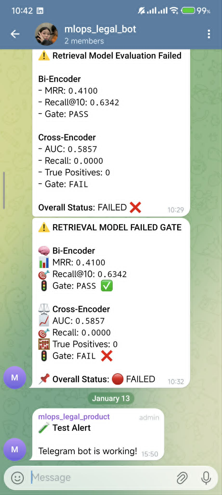

# MLOps Retrieval End-to-End

A production-grade MLOps system for Vietnamese legal document retrieval implementing bi-encoder and cross-encoder architecture with complete MLOps lifecycle.

## 🎯 Overview

End-to-end retrieval system built for **SoICT Hackathon 2024 Document Retrieval Challenge**, featuring:

- **DVC Pipeline**: Versioned data processing and validation
- **Dual-Model Architecture**: Bi-encoder (retrieval) + Cross-encoder (reranking)
- **Airflow Orchestration**: Automated training workflow
- **MLflow Tracking**: Experiment management and model registry
- **RunPod Serverless**: Queue-based inference deployment
- **Full Observability**: Prometheus + Grafana + Loki + Telegram alerts

## 🏗️ System Architecture

```
S3 Raw Data → DVC Pipeline → Airflow DAGs → Training (Bi + Cross Encoder)
    ↓
MLflow Registry → S3 Model Storage → RunPod Serverless Endpoints
    ↓
Prometheus ← Service Metrics → Grafana Dashboards → Alertmanager → Telegram
    ↑
Loki Logs ← Promtail
```

## 📁 Project Structure

```
mlops-retrieval-end2end/
├── airflow/                          # Workflow orchestration
│   ├── dags/                         # Training pipeline DAGs
│   └── logs/                         # Execution logs
│
├── artifacts/                        # Training outputs
│   ├── bi-encoder/                   # Model checkpoints & eval results
│   ├── cross-encoder/
│   └── corpus_embeddings/            # Pre-computed embeddings
│
├── ci/                               # Continuous Integration scripts
│   ├── build_*.sh                    # Docker builds
│   ├── lint.sh                       # Code quality checks
│   └── test.sh                       # Unit & integration tests
│
├── cd/                               # Continuous Deployment scripts
│   ├── deploy_*.sh                   # Deployment automation
│   ├── health_check.sh
│   ├── canary_deploy.sh
│   └── rollback.sh
│
├── config/                           # All configurations
│   ├── bi-encoder/                   # Train, eval, serve configs
│   ├── cross-encoder/
│   ├── data.yaml
│   ├── monitoring.yaml
│   └── rollback.yaml
│
├── data/
│   ├── raw/                          # Original S3 data
│   ├── processed/                    # Cleaned data
│   └── use/                          # Training-ready splits
│
├── docker/                           # Deployment containers
│   ├── bi_encoder/Dockerfile.serverless
│   └── cross_encoder/Dockerfile.serverless
│
├── monitoring/                       # Observability stack
│   ├── prometheus/                   # Alert rules & recording rules
│   └── grafana/dashboards/           # 3 dashboards (pipeline, bi, cross)
│
├── reports/                          # Evaluation artifacts
│   ├── bi-encoder/                   # metrics.json, predictions.csv
│   └── cross-encoder/
│
├── scripts/                          # Utility scripts
│   ├── download_checkpoints_from_s3.py
│   └── update_s3_latest.py
│
├── src/
│   ├── common/                       # Shared utilities
│   │   ├── s3_utils.py               # S3 operations
│   │   ├── configuration.py          # Config loader
│   │   ├── notify/telegram.py        # Telegram bot
│   │   └── model_gates/              # Model validation
│   │
│   ├── data/                         # Data pipeline
│   │   ├── data_ingestion.py         # S3 download
│   │   ├── processors.py             # PyVi segmentation + cleaning
│   │   └── pipeline.py               # DVC pipeline
│   │
│   ├── features/                     # Feature engineering
│   │   ├── build_corpus_embeddings.py
│   │   └── hard_negative_mining.py
│   │
│   ├── models/                       # Model implementations
│   │   ├── bi_encoder/               # BKAI wrapper + custom loss/pooling
│   │   └── cross_encoder/            # PhoRanker wrapper + BCE loss
│   │
│   ├── train/                        # Training logic
│   │   ├── bi_encoder/trainer.py
│   │   ├── cross_encoder/trainer.py
│   │   └── callbacks.py
│   │
│   ├── eval/                         # Evaluation
│   │   ├── bi_encoder_evaluator.py
│   │   ├── cross_encoder_evaluator.py
│   │   └── metrics/                  # Custom PyTorch metrics
│   │
│   ├── registry/                     # MLflow integration
│   │   ├── mlflow_client.py
│   │   ├── model_registry.py
│   │   └── promote.py
│   │
│   ├── serve/                        # Serving layer
│   │   ├── bi_encoder_service/       # FastAPI + RunPod handler
│   │   └── cross_encoder_service/
│   │
│   ├── monitoring/                   # Metrics instrumentation
│   │   ├── performance_tracker.py
│   │   ├── embedding_drift.py
│   │   └── alert_rules.py
│   │
│   └── retraining/                   # Auto-retrain logic
│       ├── policy.py
│       └── trigger.py
│
├── tests/
│   ├── unit/
│   └── integration/
│
├── dvc.yaml                          # DVC pipeline definition
└── requirements.txt
```

## 🔄 Data Pipeline

### Pipeline Stages (DVC-tracked)

1. **Data Ingestion**: Download `train.csv` and `corpus.csv` from S3
2. **Preprocessing**: Vietnamese word segmentation (PyVi) + text cleaning
3. **Data Splitting**: Train (70%) / Val (15%) / Test (15%)
4. **Validation**: Schema checks and quality gates

All transformations are versioned with DVC and stored on S3.

## 🚂 Training Pipeline

### Airflow DAG Flow

```
download_data → preprocess → word_segment → data_split → validate
    ↓
train_bi_encoder → eval_bi_encoder → save_bi_encoder
    ↓
build_corpus_embeddings → mine_hard_negatives
    ↓
train_cross_encoder → eval_cross_encoder → save_cross_encoder
    ↓
notify_telegram
```
<table align="center">
  <tr>
    <td align="center">
      
    </td>
    <td align="center">
      
    </td>
  </tr>
</table>

<p align="center">
  <i>End-to-end training pipeline orchestrated by Airflow DAGs</i>
</p>


### Bi-Encoder Training

- **Base Model**: `bkai-foundation-models/vietnamese-bi-encoder`
- **Loss**: MultipleNegativesRankingLoss / CachedMultipleNegativesRankingLoss (custom PyTorch)
- **Custom Components**: Pooling layers (mean/CLS/max) implemented from scratch
- **Evaluation Metrics**: Recall@k, MRR@k, nDCG@k, MAP@k, Hit Rate@k
- **Output**: Checkpoints, best model, eval reports (metrics.json, predictions.csv, failed_cases.csv)

### Hard Negative Mining

Uses trained bi-encoder to generate challenging negative samples for cross-encoder training.

### Cross-Encoder Training

- **Base Model**: `itdainb/PhoRanker`
- **Loss**: Binary Cross-Entropy (custom PyTorch)
- **Evaluation Metrics**: Precision@k, Reranking Accuracy, MRR Improvement, RRD, nDCG Improvement
- **Output**: Same structure as bi-encoder

### MLflow Integration

- Tracks all hyperparameters and metrics
- Registers models with unique run IDs
- Version tagging (staging/production)
- Used for model retrieval during deployment

<p align="center">
    <p align="center">
      
    </p>
<p align="center"><i>MLflow Training Metrics & Artifacts</i></p>

### Model Storage

Models stored on S3 with structure:
```
s3://mlops-retrieval-models/
├── bi-encoder/{mlflow_run_id}/
└── cross-encoder/{mlflow_run_id}/
```

### Telegram Notifications

After training completion, sends summary with:
- Final metrics (Recall@10, MRR, nDCG, etc.)
- MLflow run IDs
- S3 paths
- Training duration

## 🚀 Deployment

### RunPod Serverless Architecture

**Queue-Based System** (no persistent workers):
- Workers spin up on-demand (cold start)
- Auto-scale to zero when idle
- Pay-per-second billing
- Cost-efficient for variable traffic

### Deployment Process

1. Update `config/bi-encoder/serve.yaml` and `config/cross-encoder/serve.yaml` with trained model run IDs
2. Models downloaded from S3 using MLflow run IDs
3. Docker images built for both services
4. RunPod handlers wrap FastAPI services
5. Deploy to serverless endpoints
6. Health checks validate deployment

### Service Architecture

Each service exposes:
- `/health` - Health check endpoint
- `/infer` - Inference endpoint
- `/metrics` - Prometheus metrics

<p align="center">

<table align="center">
  <tr>
    <td align="center">
      
    </td>
    <td align="center">
      
    </td>
  </tr>
  <tr>
    <td align="center">
      
    </td>
    <td align="center">
      
    </td>
  </tr>
  <tr>
    <td align="center">
      
    </td>
    <td align="center">
      
    </td>
  </tr>
</table>

<p align="center">
  <i>RunPod serverless inference endpoints for bi-encoder and cross-encoder models</i>
</p>


## 📈 Monitoring System

### Four Pillars of ML Observability

#### 1. Reliability
- `endpoint_requests_total` - Total requests by endpoint/action/status
- `endpoint_cold_starts_total` - Cold start tracking
- `endpoint_errors_total` - Error breakdown by type

#### 2. Performance
- `endpoint_request_duration_seconds` - End-to-end latency (histogram)
- `endpoint_inference_duration_seconds` - Model inference time
- `endpoint_batch_size` - Batch size distribution

#### 3. Model Quality
- **Bi-Encoder**: `endpoint_embedding_dimension` (drift detection)
- **Cross-Encoder**: `endpoint_score_value`, `score_min/max` (distribution monitoring)

#### 4. Cost
- `endpoint_cost_per_request` - Real-time cost per request
- `endpoint_cost_per_1k_requests` - Aggregated cost metrics

**Cost calculated in-code during inference, not estimated post-facto.**

### Monitoring Stack

```
Service (instrumented) → /metrics endpoint → Ngrok (public) 
    → Prometheus (scrape + rules) → Grafana (dashboards)
    → Alertmanager → Telegram
```

<table align="center">
  <tr>
    <td align="center">
      <br/>
      <b>Prometheus</b>
    </td>
    <td align="center">
      <br/>
      <b>Grafana</b>
    </td>
  </tr>
  <tr>
    <td align="center">
      <br/>
      <b>Pushgateway</b>
    </td>
    <td align="center">
      <br/>
      <b>Alertmanager</b>
    </td>
  </tr>
</table>

<p align="center">
  <i>Core monitoring components for metrics collection, visualization, and alerting</i>
</p>


Logs collected via Promtail → Loki → displayed in Grafana alongside metrics.

### Dashboards

1. **Pipeline Dashboard**: Training progress, Airflow tasks, MLflow experiments
2. **Bi-Encoder Dashboard**: Success rate, latency P95, cold starts, embedding drift, cost
3. **Cross-Encoder Dashboard**: Reranking latency, score distribution, drift detection

### Alerting

Prometheus evaluates rules and triggers alerts for:
- High error rate (>5%)
- High latency (P95 > 2s)
- Cold start spikes
- Embedding dimension changes (silent model swap)
- Score distribution drift

Alerts sent to Telegram with dashboard links and actionable context.

### Philosophy

> "No magic, just discipline: metrics measured in code → ngrok tunnel → Prometheus calculates → Grafana visualizes → Alertmanager notifies."

## 🔄 CI/CD Pipeline

### Continuous Integration
- **Linting**: black, flake8, mypy
- **Testing**: pytest (unit + integration)
- **Build**: Docker image validation

### Continuous Deployment
- **Standard Deploy**: Build → Push → Deploy → Health Check
- **Canary Deploy**: 10% traffic → monitor → promote or rollback
- **Rollback**: Revert to previous version stored in config

All scripts in `ci/` and `cd/` directories.

## 🚀 Quick Start

### Prerequisites
```bash
python >= 3.9, docker, aws-cli, dvc, airflow
```

### Installation
```bash
git clone <repo>
cd mlops-retrieval-end2end
pip install -r requirements.txt
aws configure
dvc remote add -d s3remote s3://mlops-retrieval-data
dvc pull
```

### Run Training
```bash
# Start Airflow
export AIRFLOW_HOME=$(pwd)/airflow
airflow db init
airflow webserver -p 8080 &
airflow scheduler &

# Trigger pipeline
airflow dags trigger legal_retrieval_training_pipeline
```

### Deploy
```bash
# Update configs with trained model IDs
vim config/*/serve.yaml

# Build and deploy
bash ci/build_bi_encoder.sh
bash ci/build_cross_encoder.sh
bash cd/deploy_pipeline.sh
```

### Monitor
```bash
# Start monitoring stack
prometheus --config.file=monitoring/prometheus/prometheus.yml &
grafana-server &

# Access Grafana at http://localhost:3000
# Import dashboards from monitoring/grafana/dashboards/
```

## 📊 Key Features

✅ **Data Versioning**: DVC tracks all transformations  
✅ **Experiment Tracking**: MLflow logs everything  
✅ **Custom PyTorch**: All losses, pooling, metrics from scratch  
✅ **Automated Orchestration**: Airflow manages workflow  
✅ **Serverless Deployment**: RunPod queue-based architecture  
✅ **Full Observability**: 4-pillar monitoring with real-time alerting  
✅ **CI/CD**: Automated testing, building, deploying, rollback  
✅ **Cost Tracking**: In-code cost calculation per request  

## 🤝 Contributing

1. Fork repository
2. Create feature branch
3. Add tests and documentation
4. Run `bash ci/lint.sh` and `bash ci/test.sh`
5. Submit Pull Request

## 📝 License

MIT License

## 📧 Contact

For questions or issues, open a GitHub issue or contact via Telegram.

---

**Built for Vietnamese Legal Document Retrieval**
